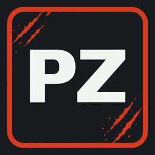

<p align="center">
  
</p>

<h1 align="center">WindowsGSM.ProjectZomboid</h1>

<p align="center">
  MeFriendos build for running a Project Zomboid dedicated server with WindowsGSM.
</p>

<p align="center">
  <a href="https://github.com/WindowsGSM/WindowsGSM"></a>
  <a href="CHANGELOG.md"></a>
  <a href="LICENSE"></a>
</p>

This plugin installs, updates and runs the Project Zomboid dedicated server through SteamCMD. The MeFriendos build is based on `WindowsGSM.ProjectZomboid` by Richard Beard and keeps its normal server behavior while preventing unrestricted automatic firewall access.

## Features

- Installs and updates the official dedicated server through SteamCMD.
- Starts the server with its bundled 64-bit Java runtime.
- Supports the embedded WindowsGSM console and graceful shutdown.
- Passes the configured WindowsGSM game port to Project Zomboid.
- Keeps the server configuration and saves inside the WindowsGSM server directory.
- Removes WindowsGSM's broad automatic `java.exe` firewall rule before Java starts listening.
- Leaves targeted manual firewall rules unchanged.

## Quick overview

| Setting | Value |
| --- | --- |
| SteamCMD App ID | `380870` |
| Start executable | `jre64\bin\java.exe` |
| Default game/query port | `16261` |
| Installation method | Anonymous SteamCMD login |
| Server configuration | `Zomboid\Server` inside the WindowsGSM server directory |
| Firewall ports | Manual configuration only |

## Requirements

- [WindowsGSM](https://github.com/WindowsGSM/WindowsGSM) 1.21 or newer
- Administrator rights for WindowsGSM
- Supported 64-bit Windows installation

Project Zomboid supplies its own Java runtime. A separate Java installation is not required.

## Plugin installation

1. Download the [latest release archive](https://github.com/PapaGordon/WindowsGSM.ProjectZomboid-MeFriendos/releases/latest).
2. Extract the complete `ProjectZomboid.cs` folder into `<WindowsGSM>\plugins\`.
3. Click **Reload Plugins** or restart WindowsGSM.
4. Add **Project Zomboid Dedicated Server** in WindowsGSM.
5. Click **Install** and wait for SteamCMD to finish.
6. Configure the required game and RCON firewall rules manually.
7. Start the server.

## Updating Project Zomboid

1. Stop the server.
2. Create a save backup.
3. Click **Update** in WindowsGSM.
4. Start the server and review the latest server log.

SteamCMD updates the dedicated-server files. The plugin does not intentionally modify your save, server INI, sandbox settings, mod list or Workshop list.

## Security: automatic port opening is disabled

WindowsGSM creates an inbound application rule for the server's bundled `jre64\bin\java.exe` before calling the plugin's start method. A broad application rule can allow every listening Java port instead of only the ports intended for Project Zomboid.

This build removes only broad inbound **Allow** rules on any network profile when all of the following match:

- the rule points to this server's exact bundled `java.exe` path;
- the local port is `Any`;
- the local address is `Any`;
- the remote address is `Any`.

Port-specific and address-restricted manual rules are preserved. Rules belonging to other Java installations or other WindowsGSM servers are not selected.

If Windows cannot verify or remove a matching broad rule, the plugin stops the launch and reports an error. This prevents the server from starting with an unknown firewall state and is why WindowsGSM must run as administrator.

The plugin does **not** create game-port or RCON rules. This is intentional: a narrow rule for a known port, protocol, network profile and remote scope is safer than allowing the complete Java runtime through the firewall.

For the MeFriendos setup, the intended manual policy is:

- Project Zomboid game traffic: required UDP ports on the **Public** profile.
- RCON: TCP on the **Private** profile for the VPN/local subnet only.
- RCON: blocked on the **Public** profile.

Adjust every port to match your WindowsGSM configuration and Project Zomboid server INI.

## Server files

Project Zomboid stores the server configuration and world data below:

```text
<WindowsGSM>\servers\<server ID>\Zomboid
```

Important server configuration files are normally found in:

```text
<WindowsGSM>\servers\<server ID>\Zomboid\Server
```

## Troubleshooting

### The server does not start after installing this build

Run WindowsGSM as administrator and check the WindowsGSM error message. The plugin refuses to launch if it cannot complete the firewall safety check.

### Players cannot connect

Confirm that the required UDP ports are allowed by a targeted manual firewall rule and forwarded by the router or provider firewall when necessary. The plugin deliberately creates no automatic port rule.

### RCON is unavailable through the VPN

Confirm that the VPN adapter uses the **Private** Windows profile and that the RCON rule is limited to the correct TCP port and VPN/local subnet.

### The server configuration is missing

Start the dedicated server once so Project Zomboid can generate its default files, then stop it before editing the INI and sandbox settings.

## Testing checklist

- WindowsGSM loads `ProjectZomboid.cs` without a plugin error.
- Install and Update complete through SteamCMD.
- The embedded console receives Project Zomboid server output.
- The server is reachable through the manually configured game ports.
- No unrestricted inbound rule remains for this server's bundled `java.exe` after startup.
- Port-specific and address-restricted manual rules remain present.
- A forced firewall-cleanup failure prevents the Java process from starting.
- RCON works over the Private VPN connection and remains unavailable publicly.

## Project links

- Source: [PapaGordon/WindowsGSM.ProjectZomboid-MeFriendos](https://github.com/PapaGordon/WindowsGSM.ProjectZomboid-MeFriendos)
- Original plugin: [DoctorBeardz/WindowsGSM.ProjectZomboid](https://github.com/DoctorBeardz/WindowsGSM.ProjectZomboid)
- Project Zomboid: [projectzomboid.com](https://projectzomboid.com)
- Community: [mefriendos.de](https://mefriendos.de)

This is an independent community plugin. It is not affiliated with or endorsed by The Indie Stone or WindowsGSM.

## License

The original plugin and this MeFriendos build are released under the [MIT License](LICENSE). The original copyright and license notice are retained.
